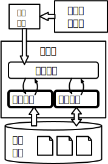

# 实验 4:查询处理

## 实验概述
本次实验为数据库系统查询处理的实验，意图通过实现基于火山模型的执行器引擎来让学生们更好地理解数据库系统如何按照查询算子逐级处理查询请求。

执行器是数据库系统将磁盘存储的页面数据处理为符合查询所需结果的模块。火山模型是一种经典的拉取式执行器模型，通过抽象算子的执行逻辑，上层算子逐层从下层算子拉取数据，算子内部完成处理后响应上层的拉取请求。通过这种方式可以在抽象结构上构建一种结构上非常简介的执行器模型，便于在执行引擎实现上的查询优化和异常处理。

<!--TODO:火山模型结构图-->

算子的实现是本次实验的难点。火山模型基于策略模式可以设计出不同的算子结构，并结合工厂模式可以快速创建不同类型的算子。系统根据物理计划树逐层生成算子，并调用算子的拉取函数完成查询的实际执行。部分算子在内部处理过程中需要存储中间结果来加速算子执行，例如连接算子以及聚合算子等，这种情况一般会使用内存作为中间结果的缓存。但是，部分算子在执行过程中将产生巨大存储容量的中间结果，不能够简单地存储到内存中（例如大表间的连接运算）。这类算子需要引入磁盘作为外部存储，一般称为外存算子，其中包括外存连接和外存排序算子。外存算子的执行效率对于磁盘IO的开销敏感，在实现上相较于内存算子更为复杂。本次实验要求补全几个常见的算子：连接、排序、Limit、聚合。考虑到不同算子本身实现难度的差异，基础功能中要求完成内存中的NestedLoopJoin、MergeJoin两类连接算子、排序算子以及Limit算子，高级功能在此基础上要求中引入内存资源的限制，并设计相应运算的外存算子，同时也可以选择实现难度较高的哈希连接算子以及聚合算子（二者均需要补全哈希表结构体的相关函数）。

 

## 实验目标
本次实验要求学生完成如下基础功能：

1. Limit算子：补全Limit算子，一个功能非常简单的算子，不需要保存复杂的中间结果。

2. 内存排序算法：补全排序算子，中间结果使用成员变量保存在内存中。

3. 内存连接算子：补全NestedLoop和Merge两类连接算子，中间结果使用成员变量保存在内存中。

在基础功能之上，实验框架支持学生完成以下高级功能：

1. 外存排序和连接算子：在内存排序和连接算子的基础上添加内存限制，使用外存储存中间结果，并设计内外存数据交互机制加速外存算法处理。

3. 内存哈希连接算子+聚合算子：实现内存存储的哈希表结构体，并基于哈希表实现内存哈希连接算子以及聚合算子，中间结果利用哈希表保存。

## 关联知识点

本次实验关联课件查询处理与执行器章节，重点涉及如下的知识点：

1. 火山模型：本次实验需要充分理解火山模型的设计思路以及查询的实际执行流程。
2. 内存算子：本次实验的基础功能要求理解基于内存的连接、排序、聚合等算子的算法实现以及计算、存储代价分析。
3. 外存算子：本次实验的高级功能要求理解基于外存的连接、排序算子的算法实现以及计算、存储代价和IO代价分析。

## 相关代码模块
本次实验涉及到代码中如下的功能模块：

- [excutors](./modules/index.md)：执行器相关结构体
    - [limit_executor]():
    - [orderby_executor]():
    - [nested_loop_join_executor]():
    - [merge_join_executor]():
    - [hash_join_executor]():
    - [aggregate_executor]():

相关功能模块的抽象示意图如下：

## 基础功能

基础功能侧重于函数功能的补全，通过阅读相关函数的输入输出描述以及函数解释即可完成。

### Limit算子

#### 实验描述

非常基础的一个内存算子，通过补全Limit算子结构体来理解Executor抽象结构体如何衍生出不同类型的查询算子。

#### 实现思路

按照Limit算子的功能需求补全LimitExecutor结构体成员变量和Next函数实现即可，主要用于理解Executor抽象结构体的设计。

### 内存排序算子

#### 实验描述

排序算子是一个难度适中的算子，需要处理记录的排序任务并存储排序结果，考虑到实现难度，基础功能中中间结果直接利用成员变量保存即可。

#### 实现思路

按照排序算子的功能需求补全OrderByExecutor结构体，在内存中完成记录数据并存储排序结果，需要注意到排序的增序或降序属性。

### 内存连接算子

#### 实验描述

连接算子具有多种实现方式，本次实验中要求实现NestedLoopJoin以及MergeJoin两类连接算法。前者算法实现简单，但复杂度较高；后者复杂度低，但依赖于排序算子的实现，且实现难度相对较高。总体而言，二者均为经典的连接算法，且实现方面易于修改为基于外存的连接算子。

#### 实现思路

- 步骤1：按照连接算子的功能需求补全NestedLoopJoinExecutor结构体，理解火山模型中算子如何同时处理复数个子节点。

- 步骤2：补全MergeJoinExecutor结构体，注意该算子假定底层子节点算子已经完成排序，因此该算子依赖于排序算子正确性。

## 高级功能
